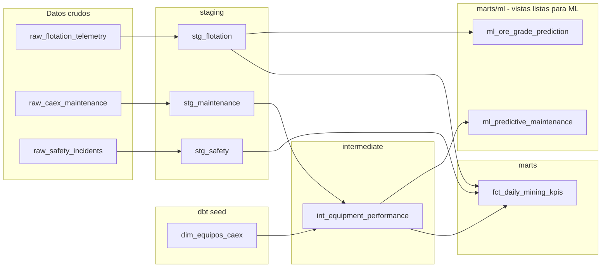
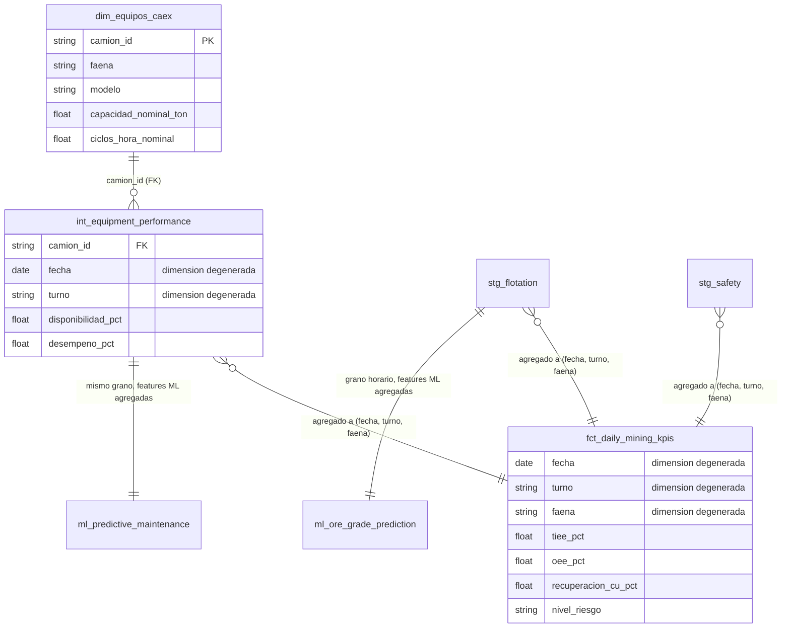
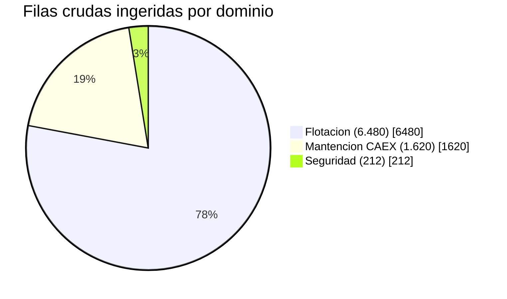
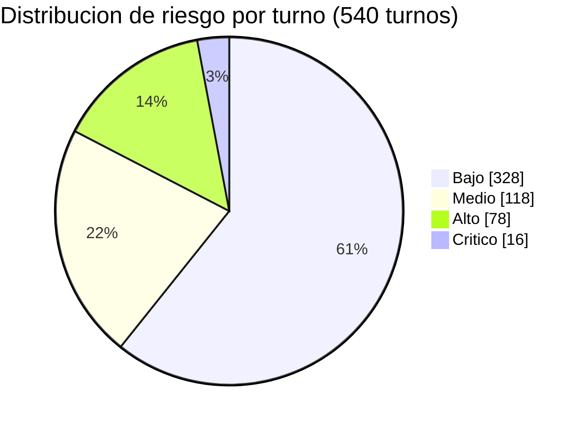

<div align="center">

# ⛏️ Data Warehouse Analítico -- Minería Chile

**Data warehouse analítico 100% local (sin servicios cloud pagados) que unifica flotación, mantención CAEX y seguridad de una faena minera chilena, construido con dbt + DuckDB**

🌐 **[English](README.md)** | **[Español](README.es.md)**

[](https://www.python.org/)
[](https://github.com/duckdb/dbt-duckdb)
[](https://github.com/dbt-labs/dbt-utils)
[](https://duckdb.org/)
[](https://www.postgresql.org/)
[](https://pola.rs/)
[](https://streamlit.io/)
[](dbt_project/models/)
[](LICENSE)

</div>

---

## 1. Problema de negocio

Las faenas mineras en Chile suelen operar tres dominios operativos de forma aislada: **flotación geometalúrgica** (telemetría de planta), **mantención CAEX** (flota de camiones de extracción), y **seguridad/reporte de incidentes** (alineado a SERNAGEOMIN). Cada dominio tiene sus propios reportes, y nadie puede responder preguntas cruzadas en un solo lugar -- por ejemplo: *"¿el turno con el incidente de seguridad también tuvo OEE degradado, y se mantuvo la recuperación?"*

Este proyecto construye un **data warehouse analítico** único que unifica los tres dominios en un grano compartido (fecha, turno, faena) y calcula KPIs integrados: disponibilidad de flota (**TIEE**), efectividad global de equipos (**OEE**, con un factor de calidad impulsado por seguridad), recuperación metalúrgica de cobre (**Recuperación % Cu**), y un **nivel de riesgo operacional**. Dos vistas analíticas adicionales (`ml_predictive_maintenance`, `ml_ore_grade_prediction`) exponen los mismos datos a grano listo para ML -- ventanas móviles, lags y columnas target explícitas -- para que un modelo pueda entrenarse directamente contra ellas sin un pipeline de feature engineering separado.

**100% local, sin servicios cloud pagados**: DuckDB es un motor OLAP embebido (un solo archivo `.duckdb` en disco), dbt-duckdb corre toda la capa de transformación SQL contra él, y Streamlit lo consulta directamente -- nada aquí requiere una cuenta cloud, suscripción a un warehouse, ni acceso a red después de `pip install`. Los mismos modelos SQL también corren sin modificación contra **Postgres** (un segundo target de dbt en `profiles.yml`, opt-in) para quien ya tenga un servidor -- cambiar de adaptador no requiere ningún cambio en `models/`, que es todo el punto de dbt.

## 2. Arquitectura y linaje dbt

```
                          src/ingest.py (Polars -> Arrow -> DuckDB)
                                        │
                     ┌──────────────────┼──────────────────┐
                     ▼                  ▼                  ▼
        raw_flotation_telemetry  raw_caex_maintenance  raw_safety_incidents
              (6.480 filas)           (1.620 filas)         (~210 filas)
```



Ejecuta `dbt docs generate && dbt docs serve` desde `dbt_project/` (con `--profiles-dir .`) para el grafo de linaje interactivo completo y documentación a nivel de columna.

## 2.1 Modelo dimensional: Star Schema, no Data Vault



Este es un **Star Schema** deliberado, no un Data Vault: una dimensión conformada (`dim_equipos_caex`) más tres **dimensiones degeneradas** (`fecha`, `turno`, `faena` -- llevadas directamente en las filas de hecho en vez de separarse en sus propias tablas de dimensión). Ese es un patrón star-schema legítimo y común a esta escala, no un atajo: una dimensión de fecha real solo se justifica cuando algo realmente la necesita (calendarios fiscales, feriados, roll-ups semana-del-año), lo que nada acá hace todavía, y `faena`/`turno` tienen exactamente 3 y 2 valores fijos cada una -- una tabla de dimensión para cualquiera de las dos sería puro overhead. Un Data Vault (Hub/Link/Satellite) es la arquitectura correcta cuando hay que rastrear cómo cambia con el tiempo el historial propio de sistemas fuente múltiples e independientemente evolutivos; este warehouse tiene tres fuentes sintéticas bien comportadas y ningún requisito de ese tipo, así que Star Schema es la elección más simple y correcta acá, no el default por inercia.

**Filas crudas ingeridas por dominio:**



**Decisiones de diseño relevantes:**

- **Disciplina de grano**: `fct_daily_mining_kpis` tiene exactamente una fila por `(fecha, turno, faena)` -- reforzado *dos veces*, a propósito: un test custom de dbt (`assert_fct_daily_kpis_grain_is_unique.sql`) y el equivalente genérico de dbt_utils (`dbt_utils.unique_combination_of_columns`), uno documentando la intención en SQL explícito, el otro el estándar declarativo. Cada modelo de staging, intermediate y mart ahora lleva el mismo test genérico en su propio grano, no solo el mart final.
- **Tests de rango de telemetría, no solo not-null**: las leyes de mineral (`ley_*_cu_pct`) están acotadas a 0-100, el pH a 0-14, las horas de turno a 0-12/0-24, vía `dbt_utils.accepted_range` -- un valor físicamente imposible (tonelaje negativo, pH 20) ahora falla el pipeline en vez de fluir en silencio hacia un KPI o una feature de ML.
- **KPI cruzado entre dominios, no solo un join**: el factor *Calidad* del OEE se calcula desde el dominio de **seguridad** (`1 - horas_detención_por_incidente / horas_turno`), de modo que un turno con mal desempeño en seguridad efectivamente arrastra hacia abajo el KPI de equipos -- ese es el punto real de unificar los tres dominios, no un join cosmético.
- **Macros reutilizables**: `safe_divide()` (división segura ante nulos/ceros, usada en todo el proyecto) y `metallurgical_recovery()` (la fórmula real de recuperación de dos productos de la metalurgia del cobre, `R = c(f-t) / f(c-t) × 100`, retorna `null` ante leyes físicamente inconsistentes en vez de un porcentaje sin sentido). `metallurgical_recovery()` ahora también se llama fila a fila (no solo agregada por turno) dentro de `ml_ore_grade_prediction`, reutilizando exactamente la misma fórmula tanto para reporting como para ML.
- **Las métricas quedan acotadas a sus límites físicos por construcción**: por ejemplo, el *Desempeño* de equipos se acota a 100% (`least(...)`, una convención estándar de OEE -- una tasa real por sobre el 100% señala una referencia nominal desactualizada, no un sobre-cumplimiento genuino), de modo que `OEE` tampoco puede superar matemáticamente el 100%.
- **Las vistas ML son vistas, no tablas, a propósito**: `ml_predictive_maintenance` y `ml_ore_grade_prediction` se declaran `materialized='view'` en contra del default `table` de los marts, así que un consumidor siempre lee el estado actual del warehouse, calculado en fresco desde los mismos modelos de staging/intermediate que usan los marts de reporting -- sin un pipeline de features separado que mantener sincronizado.

## 3. Stack tecnológico

| Capa | Elección |
|---|---|
| Lenguaje | Python 3.10/3.11+ |
| Motor OLAP | DuckDB (embebido, un solo archivo, en disco) -- target por defecto |
| Segundo adaptador | Postgres (`dbt-postgres`), target opt-in, cero cambios de modelo |
| Transformación | dbt-duckdb / dbt-postgres (modelado SQL de dbt-core, tests, docs, linaje) |
| Paquete de calidad de datos | `dbt_utils` (`unique_combination_of_columns`, `accepted_range`) |
| Ingesta / ETL | Polars + PyArrow (DataFrame → Arrow → DuckDB, sin copias) |
| Dashboard | Streamlit, consultando DuckDB directamente con SQL |
| Tests | pytest (ingesta + validación de esquema del pipeline) + tests genéricos, dbt_utils y singulares de dbt (warehouse) |

## 4. Estructura del proyecto

```
data-warehouse-analitico-mineria-chile/
├── data/                              # mining_dw.duckdb (generado, en .gitignore)
├── dbt_project/
│   ├── models/
│   │   ├── staging/                   # stg_flotation, stg_maintenance, stg_safety
│   │   ├── intermediate/              # int_equipment_performance
│   │   ├── marts/                     # fct_daily_mining_kpis
│   │   └── marts/ml/                  # ml_predictive_maintenance, ml_ore_grade_prediction
│   ├── seeds/                         # dim_equipos_caex.csv (dimensión de flota)
│   ├── tests/                         # 3 tests SQL singulares custom
│   ├── packages.yml                   # dependencia dbt_utils
│   ├── package-lock.yml               # versión resuelta fijada (comiteado)
│   ├── macros/                        # safe_divide, metallurgical_recovery
│   ├── dbt_project.yml
│   └── profiles.yml                   # autocontenido, no requiere ~/.dbt
├── src/
│   ├── ingest.py                      # generador de datos crudos sintéticos + carga a DuckDB
│   └── orchestrator.py                # ingesta -> dbt deps/seed/run -> dbt test (building block)
├── run_pipeline.py                    # orquestador a nivel de repo: agrega validación de esquema DuckDB
├── app.py                             # Dashboard ejecutivo Streamlit
├── tests/                             # tests unitarios pytest: ingesta + validación de esquema
├── requirements.txt
├── pytest.ini
├── .gitignore
├── README.md
└── README.es.md
```

## 5. Instalación

```powershell
git clone https://github.com/Rxyxs/data-warehouse-analitico-mineria-chile.git
cd data-warehouse-analitico-mineria-chile

python -m venv .venv
.venv\Scripts\activate        # Windows
# source .venv/bin/activate   # macOS/Linux

pip install -r requirements.txt
```

## 6. Uso

**Un solo comando, sin intervención humana** -- genera los datos crudos, instala `dbt_utils`, carga la dimensión de equipos, construye todos los modelos dbt (incluidas las dos vistas ML), **valida el esquema DuckDB resultante contra un contrato explícito**, y corre todos los tests de calidad:

```powershell
python run_pipeline.py
```

O ejecuta cada etapa por separado:

```powershell
python -m src.ingest                                                          # 1. datos crudos -> DuckDB
dbt deps --project-dir dbt_project --profiles-dir dbt_project                 # 2. instala dbt_utils
dbt seed --project-dir dbt_project --profiles-dir dbt_project                 # 3. dimensión de equipos
dbt run  --project-dir dbt_project --profiles-dir dbt_project                 # 4. staging -> intermediate -> marts -> ml
dbt test --project-dir dbt_project --profiles-dir dbt_project                 # 5. tests de calidad de datos
```

`python -m src.orchestrator` sigue funcionando también (la versión de cuatro pasos sin validación de esquema) -- `run_pipeline.py` es el entrypoint más completo a nivel de repo construido sobre él, no un reemplazo.

**Correr contra Postgres en vez de DuckDB** (requiere un servidor Postgres alcanzable; `dev`/DuckDB sigue siendo el default para que el flujo offline de arriba no necesite ningún cambio):

```powershell
$env:MINING_DW_PG_HOST = "localhost"        # defaults mostrados; sobreescribir si hace falta
$env:MINING_DW_PG_USER = "mining_dw"
$env:MINING_DW_PG_PASSWORD = "mining_dw"
$env:MINING_DW_PG_DATABASE = "mining_dw"
python run_pipeline.py --target postgres
```

Verificado en este repositorio vía `dbt debug --target postgres` (el perfil se resuelve y el adaptador de Postgres carga correctamente, confirmado al llegar al intento de conexión mismo) y `dbt parse`/compilación de modelos -- un `dbt run --target postgres` completo contra un servidor real no se ejecuta acá, ya que levantar uno no forma parte del diseño de cero-dependencia-cloud de este proyecto (ver §10).

**Consultar las vistas ML directamente** (después de `python run_pipeline.py`, desde cualquier cliente DuckDB):

```sql
select * from ml_predictive_maintenance where falla_siguiente_turno is not null;
select * from ml_ore_grade_prediction where target_recuperacion_cu_pct is not null;
```

**Levantar el dashboard** (después de que el pipeline haya corrido al menos una vez):

```powershell
streamlit run app.py
```

Cuatro pestañas: resumen ejecutivo (tarjetas KPI TIEE/OEE/Recuperación/Incidentes + tabla de detalle), tendencias en el tiempo, riesgo operacional (distribución de riesgo por turno + detalle de turnos Alto/Crítico), y desempeño de equipos por camión.

## 7. Resultados validados

Todos los números a continuación provienen de ejecutar realmente el pipeline de este repositorio:

| Métrica | Valor |
|---|---|
| Filas crudas ingeridas | 6.480 flotación + 1.620 mantención + 212 incidentes de seguridad |
| Seed dbt | 1 (`dim_equipos_caex`, 9 camiones CAEX en 3 faenas) |
| Modelos dbt construidos | 7 (3 staging + 1 intermediate + 1 mart + 2 vistas ML) |
| Tests dbt | **83/83 pasando** (genéricos + `dbt_utils` + 3 tests singulares custom) |
| Filas en `fct_daily_mining_kpis` | 540 (3 faenas × 90 días × 2 turnos) |
| Filas en `ml_predictive_maintenance` | 1.620 -- mismo grano que `int_equipment_performance`; 1.611 tienen `falla_siguiente_turno` no nulo (todos menos el último turno observado por camión) |
| Filas en `ml_ore_grade_prediction` | 6.480 -- grano horario; `target_recuperacion_cu_pct` no nulo en las 6.480 (sin tripletas de ley físicamente inconsistentes en esta corrida sintética) |
| Rango de OEE | 37,2% -- 90,4% (promedio 69,0%) -- correctamente acotado a ≤ 100% |
| Rango de Recuperación % Cu | 81,1% -- 85,7% (promedio 83,4%) -- realista para flotación de cobre |
| Distribución de riesgo por turno | Bajo 328 · Medio 118 · Alto 78 · Crítico 16 |



### 7.1 Qué cubren realmente los 83 tests de dbt

El salto de 34 a 83 tests no es solo más de lo mismo -- son las tres categorías que pidió el encargo, aplicadas en cada capa:

| Categoría de test | Ejemplo | Dónde |
|---|---|---|
| Unicidad (clave de negocio) | `dbt_utils.unique_combination_of_columns` sobre `(camion_id, fecha, turno)` | Cada modelo a grano camión/turno -- `stg_maintenance`, `int_equipment_performance`, `ml_predictive_maintenance` -- más `(faena, ts)` en los dos modelos a grano horario de flotación |
| No nulos | `not_null` de dbt-core, en cada clave y cada columna de KPI/target | Todas las capas |
| Rangos de telemetría | `dbt_utils.accepted_range`: leyes de mineral 0-100%, pH 0-14, horas de turno 0-12, factor de llenado 0-1,3 | `stg_flotation`, `stg_maintenance`, `int_equipment_performance`, ambos marts |

El test de unicidad de grano en `fct_daily_mining_kpis` está duplicado a propósito: el test SQL custom original (`assert_fct_daily_kpis_grain_is_unique.sql`) se mantiene junto al nuevo `dbt_utils.unique_combination_of_columns` -- mismo chequeo, dos idiomas, se mantuvieron ambos en vez de borrar el singular para mostrar la modernización en vez de esconder el enfoque anterior.

### 7.2 Vistas listas para ML, verificadas de punta a punta

```sql
-- ml_predictive_maintenance: 1.620 filas, grano (camion_id, fecha, turno)
select camion_id, fecha, turno, disponibilidad_rolling_7t,
       turnos_desde_ultima_falla, falla_no_programada_flag, falla_siguiente_turno
from ml_predictive_maintenance limit 3;

-- ml_ore_grade_prediction: 6.480 filas, grano (faena, ts)
select faena, ts, ley_alimentacion_cu_pct, dosis_reactivo_rolling_6h,
       target_ley_concentrado_cu_pct, target_recuperacion_cu_pct
from ml_ore_grade_prediction limit 3;
```

`turnos_desde_ultima_falla` (largo de la racha desde el último turno con falla no programada, por camión) va de 0 a 72 turnos en esta corrida, con un promedio de ~11,7 -- consistente con la probabilidad de falla del 8% por turno de la ingesta, y exactamente el tipo de feature que un modelo estilo RUL necesita y que un mart de reporting plano no calcularía. Ambas vistas pasaron todos los tests `dbt_utils.accepted_range`/`unique_combination_of_columns` de la §7.1 en la primera corrida real reportada acá -- el bug de grano en las funciones de ventana detectado durante el desarrollo (una versión temprana referenciaba la CTE equivocada y no compilaba) se corrigió antes de generar cualquiera de estos números, no después.

## 8. Metodología de KPIs y disclaimer de datos

Todos los datos (telemetría de flotación, registros de mantención CAEX, incidentes de seguridad -- generados por `src/ingest.py` directamente en `data/mining_dw.duckdb`) son **100% sintéticos**, generados con una semilla fija. Los nombres de faena (Andina, Los Bronces, El Teniente) y modelos de camión CAEX (Caterpillar 797F, Komatsu 930E, Liebherr T284) se usan solo como color realista del dominio -- ninguna cifra representa operación real de esas faenas.

- **Recuperación % Cu** usa la fórmula real y estándar de recuperación metalúrgica de dos productos.
- **TIEE**, el factor de calidad del **OEE**, y el **Nivel de Riesgo** son **KPIs compuestos propios del proyecto** (documentados en `dbt_project/models/marts/schema.yml`), no índices regulatorios o estándares de industria externos -- construidos de forma transparente desde campos operacionales crudos, de modo que la fórmula siempre es inspeccionable en el SQL del modelo dbt.

## 9. Testing

```powershell
pytest -v                                                                      # 8 tests: invariantes de la ingesta + contrato de validación de esquema
dbt test --project-dir dbt_project --profiles-dir dbt_project                  # 83 tests: calidad de datos del warehouse
```

Los 4 tests pytest nuevos ejercitan `validate_duckdb_schema()` de `run_pipeline.py` directamente contra archivos DuckDB desechables (`tmp_path`, no el warehouse real) -- confirmando que pasa con un contrato satisfecho y falla con un error específico y legible ante una tabla faltante, una columna faltante, y una base de datos inexistente, de modo que el paso de validación de esquema en sí queda verificado, no solo ejercitado como efecto secundario de que el pipeline completo funcione.

## 10. Posibles extensiones

- Cambiar DuckDB por Snowflake/BigQuery de la misma forma en que se agregó Postgres -- un nuevo target en `profiles.yml` y el paquete `dbt-<adapter>` correspondiente, cero cambios de código en los modelos (este repositorio ya probó el patrón una vez con Postgres).
- Ejercitar `dbt run --target postgres` contra un servidor Postgres real corriendo (este repositorio verificó la resolución de perfil/adaptador y la compilación, no una corrida en vivo, según §6 y el alcance de cero-dependencia-cloud de la §10) -- p. ej. levantado vía un `docker run postgres` local para quien quiera confirmar el recorrido completo.
- Alimentar `ml_predictive_maintenance` y `ml_ore_grade_prediction` directamente a los modelos ya construidos en [chile-mining-predictive-maintenance](https://github.com/Rxyxs/chile-mining-predictive-maintenance) -- todo el punto de entregarlas como vistas listas para ML en vez de solo marts de reporting más ricos -- y a [rag-seguridad-minera-chile](https://github.com/Rxyxs/rag-seguridad-minera-chile) para un sistema de circuito cerrado "detectar → explicar → actuar".
- Agregar tests de relación entre tablas estilo `dbt_utils.relationships` (p. ej. cada `camion_id` en `stg_maintenance` existe en `dim_equipos_caex`) ahora que el paquete está instalado -- no agregado todavía porque cada `camion_id` de este dataset sintético se genera desde la misma lista fija, por lo que el test seria tautológico por ahora; vale la pena agregarlo cuando exista data fuente real o más variada.

## Licencia

MIT -- ver [LICENSE](LICENSE).

## Autor

**Pablo Reyes** -- [github.com/Rxyxs](https://github.com/Rxyxs)
