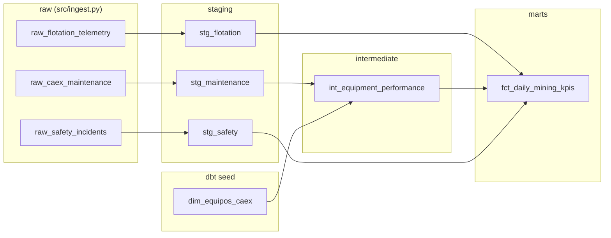

<div align="center">

# ⛏️ Data Warehouse Analítico -- Minería Chile

**Data warehouse analítico 100% local (sin servicios cloud pagados) que unifica flotación, mantención CAEX y seguridad de una faena minera chilena, construido con dbt + DuckDB**

🌐 **[English](README.md)** | **[Español](README.es.md)**

[](https://www.python.org/)
[](https://github.com/duckdb/dbt-duckdb)
[](https://duckdb.org/)
[](https://pola.rs/)
[](https://streamlit.io/)
[](dbt_project/tests/)
[](LICENSE)

</div>

---

## 1. Problema de negocio

Las faenas mineras en Chile suelen operar tres dominios operativos de forma aislada: **flotación geometalúrgica** (telemetría de planta), **mantención CAEX** (flota de camiones de extracción), y **seguridad/reporte de incidentes** (alineado a SERNAGEOMIN). Cada dominio tiene sus propios reportes, y nadie puede responder preguntas cruzadas en un solo lugar -- por ejemplo: *"¿el turno con el incidente de seguridad también tuvo OEE degradado, y se mantuvo la recuperación?"*

Este proyecto construye un **data warehouse analítico** único que unifica los tres dominios en un grano compartido (fecha, turno, faena) y calcula KPIs integrados: disponibilidad de flota (**TIEE**), efectividad global de equipos (**OEE**, con un factor de calidad impulsado por seguridad), recuperación metalúrgica de cobre (**Recuperación % Cu**), y un **nivel de riesgo operacional**.

**100% local, sin servicios cloud pagados**: DuckDB es un motor OLAP embebido (un solo archivo `.duckdb` en disco), dbt-duckdb corre toda la capa de transformación SQL contra él, y Streamlit lo consulta directamente -- nada aquí requiere una cuenta cloud, suscripción a un warehouse, ni acceso a red después de `pip install`.

## 2. Arquitectura y linaje dbt

```
                          src/ingest.py (Polars -> Arrow -> DuckDB)
                                        │
                     ┌──────────────────┼──────────────────┐
                     ▼                  ▼                  ▼
        raw_flotation_telemetry  raw_caex_maintenance  raw_safety_incidents
              (6.480 filas)           (1.620 filas)         (~210 filas)
```



Ejecuta `dbt docs generate && dbt docs serve` desde `dbt_project/` (con `--profiles-dir .`) para el grafo de linaje interactivo completo y documentación a nivel de columna.

**Decisiones de diseño relevantes:**

- **Disciplina de grano**: `fct_daily_mining_kpis` tiene exactamente una fila por `(fecha, turno, faena)` -- reforzado por un test custom de dbt (`assert_fct_daily_kpis_grain_is_unique.sql`), no solo asumido.
- **KPI cruzado entre dominios, no solo un join**: el factor *Calidad* del OEE se calcula desde el dominio de **seguridad** (`1 - horas_detención_por_incidente / horas_turno`), de modo que un turno con mal desempeño en seguridad efectivamente arrastra hacia abajo el KPI de equipos -- ese es el punto real de unificar los tres dominios, no un join cosmético.
- **Macros reutilizables**: `safe_divide()` (división segura ante nulos/ceros, usada en todo el proyecto) y `metallurgical_recovery()` (la fórmula real de recuperación de dos productos de la metalurgia del cobre, `R = c(f-t) / f(c-t) × 100`, retorna `null` ante leyes físicamente inconsistentes en vez de un porcentaje sin sentido).
- **Las métricas quedan acotadas a sus límites físicos por construcción**: por ejemplo, el *Desempeño* de equipos se acota a 100% (`least(...)`, una convención estándar de OEE -- una tasa real por sobre el 100% señala una referencia nominal desactualizada, no un sobre-cumplimiento genuino), de modo que `OEE` tampoco puede superar matemáticamente el 100%.

## 3. Stack tecnológico

| Capa | Elección |
|---|---|
| Lenguaje | Python 3.10/3.11+ |
| Motor OLAP | DuckDB (embebido, un solo archivo, en disco) |
| Transformación | dbt-duckdb (modelado SQL de dbt-core, tests, docs, linaje) |
| Ingesta / ETL | Polars + PyArrow (DataFrame → Arrow → DuckDB, sin copias) |
| Dashboard | Streamlit, consultando DuckDB directamente con SQL |
| Tests | pytest (ingesta) + tests genéricos y singulares de dbt (warehouse) |

## 4. Estructura del proyecto

```
data-warehouse-analitico-mineria-chile/
├── data/                              # mining_dw.duckdb (generado, en .gitignore)
├── dbt_project/
│   ├── models/
│   │   ├── staging/                   # stg_flotation, stg_maintenance, stg_safety
│   │   ├── intermediate/              # int_equipment_performance
│   │   └── marts/                     # fct_daily_mining_kpis
│   ├── seeds/                         # dim_equipos_caex.csv (dimensión de flota)
│   ├── tests/                         # 3 tests SQL singulares custom
│   ├── macros/                        # safe_divide, metallurgical_recovery
│   ├── dbt_project.yml
│   └── profiles.yml                   # autocontenido, no requiere ~/.dbt
├── src/
│   ├── ingest.py                      # generador de datos crudos sintéticos + carga a DuckDB
│   └── orchestrator.py                # ingesta -> dbt seed -> dbt run -> dbt test
├── app.py                             # Dashboard ejecutivo Streamlit
├── tests/                             # tests unitarios pytest de la ingesta
├── requirements.txt
├── pytest.ini
├── .gitignore
├── README.md
└── README.es.md
```

## 5. Instalación

```powershell
git clone https://github.com/Rxyxs/data-warehouse-analitico-mineria-chile.git
cd data-warehouse-analitico-mineria-chile

python -m venv .venv
.venv\Scripts\activate        # Windows
# source .venv/bin/activate   # macOS/Linux

pip install -r requirements.txt
```

## 6. Uso

**Un solo comando, sin intervención humana** -- genera los datos crudos, carga la dimensión de equipos, construye todos los modelos dbt, y corre todos los tests:

```powershell
python -m src.orchestrator
```

O ejecuta cada etapa por separado:

```powershell
python -m src.ingest                                                          # 1. datos crudos -> DuckDB
dbt seed --project-dir dbt_project --profiles-dir dbt_project                 # 2. dimensión de equipos
dbt run  --project-dir dbt_project --profiles-dir dbt_project                 # 3. staging -> intermediate -> marts
dbt test --project-dir dbt_project --profiles-dir dbt_project                 # 4. tests de calidad de datos
```

**Levantar el dashboard** (después de que el orquestador haya corrido al menos una vez):

```powershell
streamlit run app.py
```

Cuatro pestañas: resumen ejecutivo (tarjetas KPI TIEE/OEE/Recuperación/Incidentes + tabla de detalle), tendencias en el tiempo, riesgo operacional (distribución de riesgo por turno + detalle de turnos Alto/Crítico), y desempeño de equipos por camión.

## 7. Resultados validados

Todos los números a continuación provienen de ejecutar realmente el pipeline de este repositorio:

| Métrica | Valor |
|---|---|
| Filas crudas ingeridas | 6.480 flotación + 1.620 mantención + 212 incidentes de seguridad |
| Seed dbt | 1 (`dim_equipos_caex`, 9 camiones CAEX en 3 faenas) |
| Modelos dbt construidos | 5 (3 staging + 1 intermediate + 1 mart) |
| Tests dbt | **34/34 pasando** (genéricos: unique/not_null/accepted_values + 3 tests singulares custom) |
| Filas en `fct_daily_mining_kpis` | 540 (3 faenas × 90 días × 2 turnos) |
| Rango de OEE | 37,2% -- 90,4% (promedio 69,0%) -- correctamente acotado a ≤ 100% |
| Rango de Recuperación % Cu | 81,1% -- 85,7% (promedio 83,4%) -- realista para flotación de cobre |
| Distribución de riesgo por turno | Bajo 328 · Medio 118 · Alto 78 · Crítico 16 |

## 8. Metodología de KPIs y disclaimer de datos

Todos los datos (telemetría de flotación, registros de mantención CAEX, incidentes de seguridad -- generados por `src/ingest.py` directamente en `data/mining_dw.duckdb`) son **100% sintéticos**, generados con una semilla fija. Los nombres de faena (Andina, Los Bronces, El Teniente) y modelos de camión CAEX (Caterpillar 797F, Komatsu 930E, Liebherr T284) se usan solo como color realista del dominio -- ninguna cifra representa operación real de esas faenas.

- **Recuperación % Cu** usa la fórmula real y estándar de recuperación metalúrgica de dos productos.
- **TIEE**, el factor de calidad del **OEE**, y el **Nivel de Riesgo** son **KPIs compuestos propios del proyecto** (documentados en `dbt_project/models/marts/schema.yml`), no índices regulatorios o estándares de industria externos -- construidos de forma transparente desde campos operacionales crudos, de modo que la fórmula siempre es inspeccionable en el SQL del modelo dbt.

## 9. Testing

```powershell
pytest -v                                                                      # 4 tests: invariantes de la ingesta
dbt test --project-dir dbt_project --profiles-dir dbt_project                  # 34 tests: calidad de datos del warehouse
```

## 10. Posibles extensiones

- Cambiar DuckDB por Postgres/Snowflake modificando solo `profiles.yml` (el punto central de dbt) -- sin cambios de código en los modelos.
- Agregar tests de relación entre tablas estilo `dbt_utils` cuando haya acceso a internet para `dbt deps` (se mantuvo el proyecto sin dependencias externas para que sea 100% ejecutable offline).
- Alimentar `fct_daily_mining_kpis` a los clasificadores/asistente RAG ya construidos en [rag-seguridad-minera-chile](https://github.com/Rxyxs/rag-seguridad-minera-chile) y [chile-mining-predictive-maintenance](https://github.com/Rxyxs/chile-mining-predictive-maintenance) para un sistema de circuito cerrado "detectar → explicar → actuar".

## Licencia

MIT -- ver [LICENSE](LICENSE).

## Autor

**Pablo Reyes** -- [github.com/Rxyxs](https://github.com/Rxyxs)
