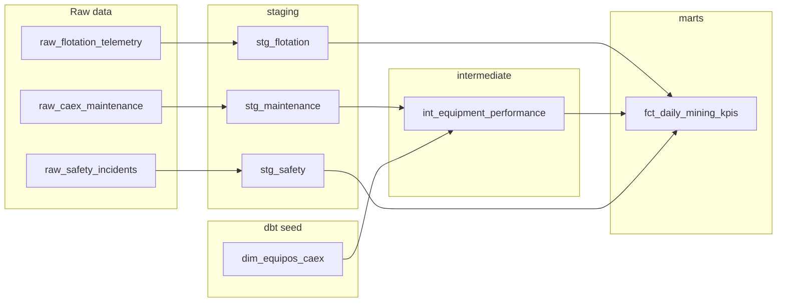
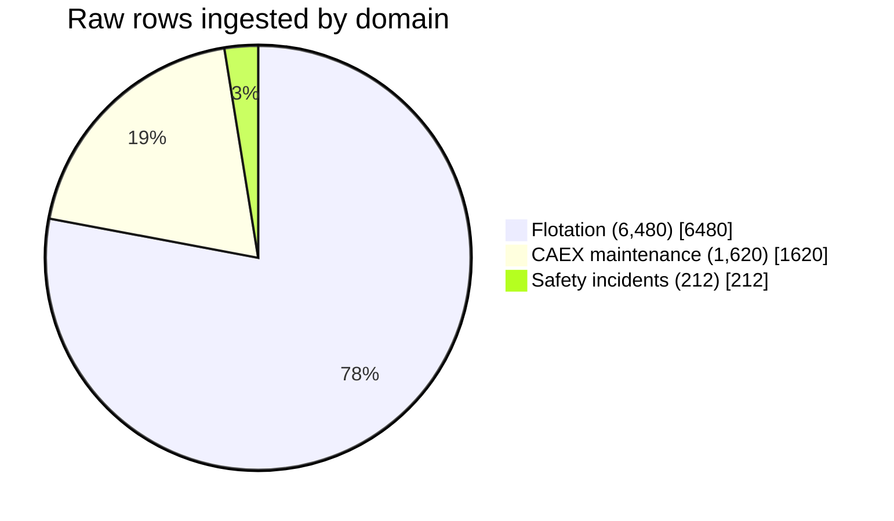
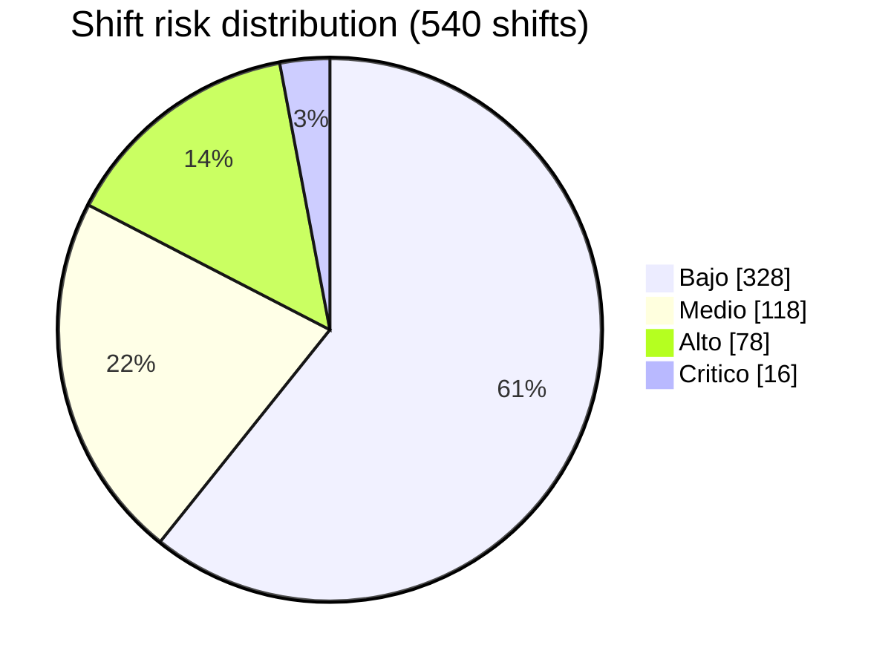

<div align="center">

# ⛏️ Data Warehouse Analítico -- Minería Chile

**A fully local (no paid cloud) analytics warehouse unifying flotation, CAEX maintenance, and safety data for a Chilean mining site, built with dbt + DuckDB**

🌐 **[English](README.md)** | **[Español](README.es.md)**

[](https://www.python.org/)
[](https://github.com/duckdb/dbt-duckdb)
[](https://duckdb.org/)
[](https://pola.rs/)
[](https://streamlit.io/)
[](dbt_project/tests/)
[](LICENSE)

</div>

---

## 1. Business problem

Mining sites in Chile typically run three operational domains in isolation: **geometallurgical flotation** (plant telemetry), **CAEX predictive/reactive maintenance** (haul truck fleet), and **safety/incident reporting** (SERNAGEOMIN-aligned). Each domain has its own reports, and nobody can answer cross-domain questions in one place -- e.g. *"did the shift with the safety incident also have degraded OEE, and did recovery hold up?"*

This project builds a single **analytical data warehouse** that unifies the three domains at a shared grain (date, shift, site) and computes integrated KPIs: fleet availability (**TIEE**), overall equipment effectiveness (**OEE**, with a safety-driven quality factor), copper metallurgical recovery (**Recuperación % Cu**), and an **operational risk level**.

**100% local, no paid cloud services**: DuckDB is an embedded OLAP engine (a single `.duckdb` file on disk), dbt-duckdb runs the whole SQL transformation layer against it, and Streamlit queries it directly -- nothing here requires a cloud account, warehouse subscription, or network access after `pip install`.

## 2. Architecture & dbt lineage

```
                          src/ingest.py (Polars -> Arrow -> DuckDB)
                                        │
                     ┌──────────────────┼──────────────────┐
                     ▼                  ▼                  ▼
        raw_flotation_telemetry  raw_caex_maintenance  raw_safety_incidents
              (6,480 rows)            (1,620 rows)          (~210 rows)
```



Run `dbt docs generate && dbt docs serve` from `dbt_project/` (with `--profiles-dir .`) for the full interactive lineage graph and column-level documentation.

**Raw rows ingested by domain:**



**Design decisions worth calling out:**

- **Grain discipline**: `fct_daily_mining_kpis` has exactly one row per `(fecha, turno, faena)` -- enforced by a custom dbt test (`assert_fct_daily_kpis_grain_is_unique.sql`), not just assumed.
- **Cross-domain KPI, not just a join**: the *Quality* factor of OEE is computed from the **safety** domain (`1 - horas_detención_por_incidente / horas_turno`), so a bad safety shift measurably drags down the equipment KPI -- this is the actual point of unifying the three domains, not a cosmetic join.
- **Reusable macros**: `safe_divide()` (null/zero-safe division, used throughout) and `metallurgical_recovery()` (the real two-product recovery formula from copper metallurgy, `R = c(f-t) / f(c-t) × 100`, returns `null` on physically inconsistent grades instead of a nonsense percentage).
- **Metrics are capped at their physical bounds by construction**: e.g. equipment *Performance* is clamped to 100% (`least(...)`, a standard OEE convention -- a real ratio above 100% signals a stale nominal reference, not genuine overperformance), so `OEE` can never mathematically exceed 100% either.

## 3. Tech stack

| Layer | Choice |
|---|---|
| Language | Python 3.10/3.11+ |
| OLAP engine | DuckDB (embedded, single-file, disk-backed) |
| Transformation | dbt-duckdb (dbt-core SQL modeling, tests, docs, lineage) |
| Ingestion / ETL | Polars + PyArrow (DataFrame → Arrow → DuckDB, zero-copy) |
| Dashboard | Streamlit, querying DuckDB directly with SQL |
| Tests | pytest (ingestion) + dbt generic & singular tests (warehouse) |

## 4. Project structure

```
data-warehouse-analitico-mineria-chile/
├── data/                              # mining_dw.duckdb (generated, gitignored)
├── dbt_project/
│   ├── models/
│   │   ├── staging/                   # stg_flotation, stg_maintenance, stg_safety
│   │   ├── intermediate/              # int_equipment_performance
│   │   └── marts/                     # fct_daily_mining_kpis
│   ├── seeds/                         # dim_equipos_caex.csv (fleet dimension)
│   ├── tests/                         # 3 custom singular SQL tests
│   ├── macros/                        # safe_divide, metallurgical_recovery
│   ├── dbt_project.yml
│   └── profiles.yml                   # self-contained, no ~/.dbt needed
├── src/
│   ├── ingest.py                      # synthetic raw data generator + DuckDB loader
│   └── orchestrator.py                # ingest -> dbt seed -> dbt run -> dbt test
├── app.py                             # Streamlit executive dashboard
├── tests/                             # pytest unit tests for ingestion
├── requirements.txt
├── pytest.ini
├── .gitignore
├── README.md
└── README.es.md
```

## 5. Setup

```powershell
git clone https://github.com/Rxyxs/data-warehouse-analitico-mineria-chile.git
cd data-warehouse-analitico-mineria-chile

python -m venv .venv
.venv\Scripts\activate        # Windows
# source .venv/bin/activate   # macOS/Linux

pip install -r requirements.txt
```

## 6. Usage

**One command, no human intervention** -- generates the raw data, seeds the equipment dimension, builds every dbt model, and runs every test:

```powershell
python -m src.orchestrator
```

Or run each stage individually:

```powershell
python -m src.ingest                                                          # 1. raw data -> DuckDB
dbt seed --project-dir dbt_project --profiles-dir dbt_project                 # 2. equipment dimension
dbt run  --project-dir dbt_project --profiles-dir dbt_project                 # 3. staging -> intermediate -> marts
dbt test --project-dir dbt_project --profiles-dir dbt_project                 # 4. data quality tests
```

**Launch the dashboard** (after the orchestrator has run at least once):

```powershell
streamlit run app.py
```

Four tabs: executive summary (TIEE/OEE/Recovery/Incidents KPI cards + detail table), trends over time, operational risk (shift-level risk distribution + drill-down on Alto/Crítico shifts), and per-truck equipment performance.

## 7. Validated results

All numbers below come from actually running the pipeline in this repo:

| Metric | Value |
|---|---|
| Raw rows ingested | 6,480 flotation + 1,620 maintenance + 212 safety incidents |
| dbt seed | 1 (`dim_equipos_caex`, 9 CAEX trucks across 3 faenas) |
| dbt models built | 5 (3 staging + 1 intermediate + 1 mart) |
| dbt tests | **34/34 passing** (generic: unique/not_null/accepted_values + 3 custom singular tests) |
| `fct_daily_mining_kpis` rows | 540 (3 faenas × 90 days × 2 turnos) |
| OEE range | 37.2% -- 90.4% (avg 69.0%) -- correctly bounded ≤ 100% |
| Recuperación % Cu range | 81.1% -- 85.7% (avg 83.4%) -- realistic for copper flotation |
| Shift risk distribution | Bajo 328 · Medio 118 · Alto 78 · Crítico 16 |



## 8. KPI methodology & data disclaimer

All raw data (flotation telemetry, CAEX maintenance logs, safety incidents -- generated by `src/ingest.py` directly into `data/mining_dw.duckdb`) is **100% synthetic**, generated with a fixed seed. Site names (Andina, Los Bronces, El Teniente) and CAEX truck models (Caterpillar 797F, Komatsu 930E, Liebherr T284) are used only as realistic domain color -- no figure represents real operational data from those sites.

- **Recuperación % Cu** uses the real, standard two-product metallurgical recovery formula.
- **TIEE**, **OEE**'s quality factor, and **Nivel de Riesgo** are **project-defined composite KPIs** (documented in `dbt_project/models/marts/schema.yml`), not external regulatory or industry-standard indices -- built transparently from raw operational fields so the formula is always inspectable in the dbt model SQL.

## 9. Testing

```powershell
pytest -v                                                                      # 4 tests: ingestion invariants
dbt test --project-dir dbt_project --profiles-dir dbt_project                  # 34 tests: warehouse data quality
```

## 10. Possible extensions

- Swap DuckDB for Postgres/Snowflake by changing only `profiles.yml` (dbt's whole point) -- zero model code changes needed.
- Add `dbt_utils`-style cross-table relationship tests once internet access for `dbt deps` is available (kept dependency-free here to stay 100% offline-runnable).
- Feed `fct_daily_mining_kpis` into the classifiers/RAG assistant already built in [rag-seguridad-minera-chile](https://github.com/Rxyxs/rag-seguridad-minera-chile) and [chile-mining-predictive-maintenance](https://github.com/Rxyxs/chile-mining-predictive-maintenance) for a closed-loop "detect → explain → act" system.

## License

MIT -- see [LICENSE](LICENSE).

## Author

**Pablo Reyes** -- [github.com/Rxyxs](https://github.com/Rxyxs)
