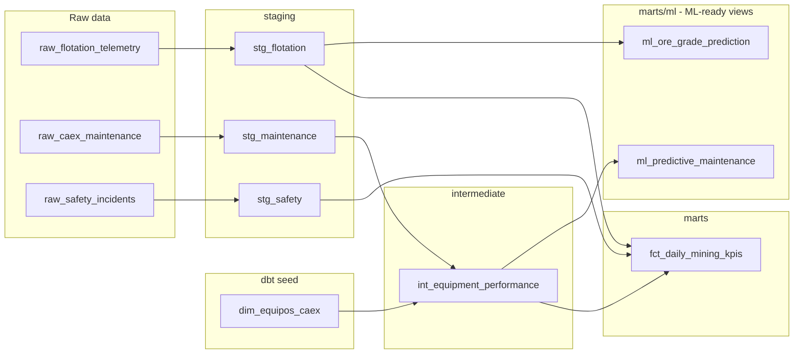
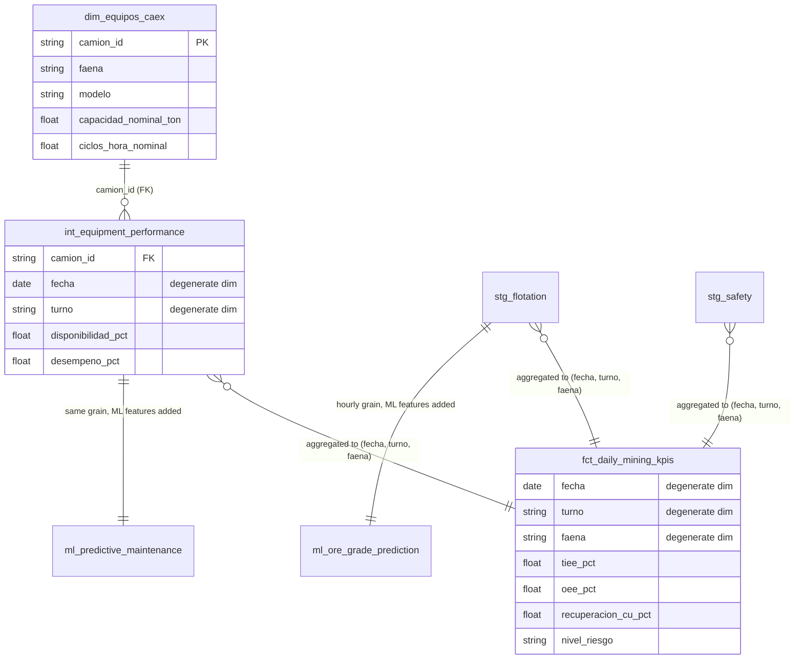
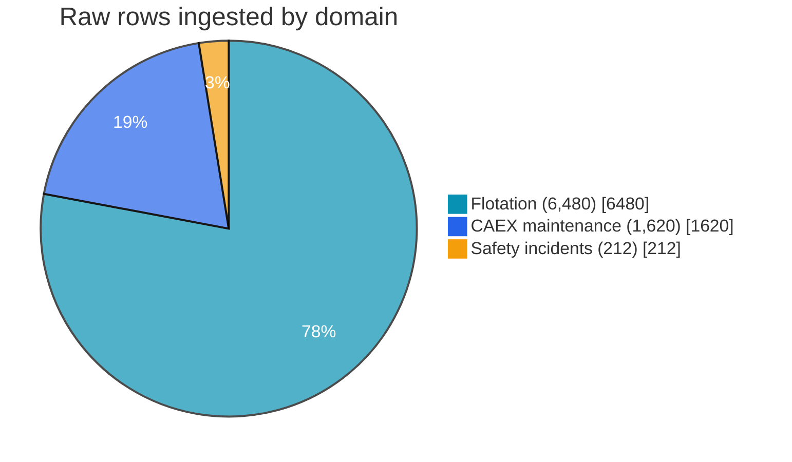
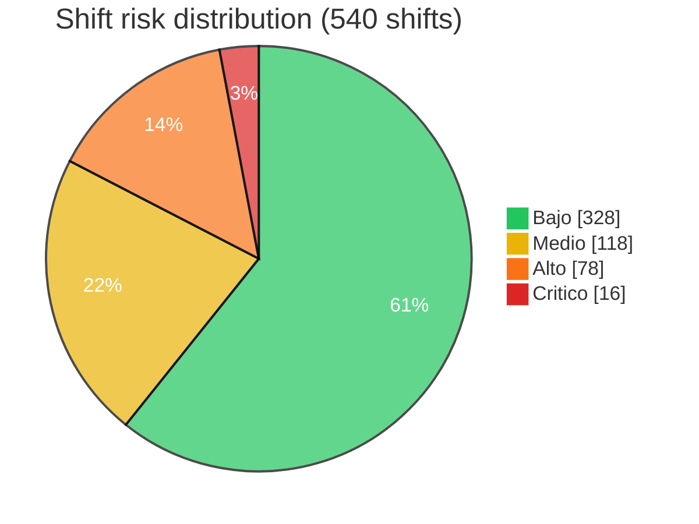

<div align="center">

# ⛏️ Data Warehouse Analítico -- Minería Chile

**A fully local (no paid cloud) analytics warehouse unifying flotation, CAEX maintenance, and safety data for a Chilean mining site, built with dbt + DuckDB**

🌐 **[English](README.md)** | **[Español](README.es.md)**

[](https://www.python.org/)
[](https://github.com/duckdb/dbt-duckdb)
[](https://github.com/dbt-labs/dbt-utils)
[](https://duckdb.org/)
[](https://www.postgresql.org/)
[](https://pola.rs/)
[](https://streamlit.io/)
[](dbt_project/models/)
[](LICENSE)

</div>

---

## 1. Business problem

Mining sites in Chile typically run three operational domains in isolation: **geometallurgical flotation** (plant telemetry), **CAEX predictive/reactive maintenance** (haul truck fleet), and **safety/incident reporting** (SERNAGEOMIN-aligned). Each domain has its own reports, and nobody can answer cross-domain questions in one place -- e.g. *"did the shift with the safety incident also have degraded OEE, and did recovery hold up?"*

This project builds a single **analytical data warehouse** that unifies the three domains at a shared grain (date, shift, site) and computes integrated KPIs: fleet availability (**TIEE**), overall equipment effectiveness (**OEE**, with a safety-driven quality factor), copper metallurgical recovery (**Recuperación % Cu**), and an **operational risk level**. Two additional analytical views (`ml_predictive_maintenance`, `ml_ore_grade_prediction`) expose the same data at ML-ready grain -- rolling windows, lags, and explicit target columns -- so a model can be trained directly against them with no separate feature-engineering pipeline.

**100% local, no paid cloud services**: DuckDB is an embedded OLAP engine (a single `.duckdb` file on disk), dbt-duckdb runs the whole SQL transformation layer against it, and Streamlit queries it directly -- nothing here requires a cloud account, warehouse subscription, or network access after `pip install`. The same SQL models also run unmodified against **Postgres** (a second dbt target in `profiles.yml`, opt-in) for anyone who already has a server -- swapping the adapter needs zero changes to `models/`, which is dbt's whole point.

## 1.1 Business Impact & Key Performance Indicators

| Metric | Result | What it means |
|---|---|---|
| dbt models built | 7 (3 staging + 1 intermediate + 1 mart + 2 ML-ready views) | Full lineage from raw ingest to analysis-ready, no manual SQL outside dbt |
| dbt tests passing | **83/83** | Grain uniqueness, not-null, and physically-plausible telemetry ranges (ore grade 0-100%, pH 0-14) enforced pipeline-wide |
| OEE range (540 shifts) | 37.2%-90.4%, avg 69.0% | Correctly bounded ≤100%, cross-domain (safety incidents measurably drag down the quality factor) |
| Copper recovery range | 81.1%-85.7%, avg 83.4% | Realistic for copper flotation, computed at the same shared grain as fleet/safety KPIs |
| ML-ready views | 2 (`ml_predictive_maintenance`, `ml_ore_grade_prediction`) | Rolling windows/lags/labels pre-built at the warehouse layer -- no separate feature-engineering step needed to train against them |
| Adapter portability | DuckDB (default) + Postgres (verified via `dbt debug`) | Same SQL models, zero code changes, opt-in second target |

## 2. Architecture & dbt lineage

```
                          src/ingest.py (Polars -> Arrow -> DuckDB)
                                        │
                     ┌──────────────────┼──────────────────┐
                     ▼                  ▼                  ▼
        raw_flotation_telemetry  raw_caex_maintenance  raw_safety_incidents
              (6,480 rows)            (1,620 rows)          (~210 rows)
```



Run `dbt docs generate && dbt docs serve` from `dbt_project/` (with `--profiles-dir .`) for the full interactive lineage graph and column-level documentation.

## 2.1 Dimensional model: Star Schema, not Data Vault



This is a deliberate **Star Schema**, not a Data Vault: one conformed dimension (`dim_equipos_caex`) plus three **degenerate dimensions** (`fecha`, `turno`, `faena` -- carried directly on the fact rows rather than broken out into their own dimension tables). That's a legitimate, common star-schema pattern at this scale, not a shortcut: a real date dimension only earns its keep once something actually needs it (fiscal calendars, holiday flags, week-of-year rollups), which nothing here does yet, and `faena`/`turno` each have exactly 3 and 2 fixed values -- a dimension table for either would be pure overhead. A Data Vault (Hub/Link/Satellite) is the right architecture when you need to track how source systems' own history changes over time across multiple, independently-evolving sources; this warehouse has three well-behaved synthetic sources and no such requirement, so Star Schema is the simpler, correct choice here, not the default by inertia.

**Raw rows ingested by domain:**



**Design decisions worth calling out:**

- **Grain discipline**: `fct_daily_mining_kpis` has exactly one row per `(fecha, turno, faena)` -- enforced *twice*, deliberately: a custom dbt test (`assert_fct_daily_kpis_grain_is_unique.sql`) and the dbt_utils generic equivalent (`dbt_utils.unique_combination_of_columns`), one documenting the intent in explicit SQL, the other the declarative standard. Every staging, intermediate, and mart model now carries the same generic test at its own grain, not just the final mart.
- **Telemetry range tests, not just not-null**: ore grades (`ley_*_cu_pct`) are bounded 0-100, pH 0-14, hours-in-a-shift 0-12/0-24, via `dbt_utils.accepted_range` -- a physically-impossible value (negative tonnage, pH 20) now fails the pipeline instead of silently flowing into a KPI or an ML feature.
- **Cross-domain KPI, not just a join**: the *Quality* factor of OEE is computed from the **safety** domain (`1 - horas_detención_por_incidente / horas_turno`), so a bad safety shift measurably drags down the equipment KPI -- this is the actual point of unifying the three domains, not a cosmetic join.
- **Reusable macros**: `safe_divide()` (null/zero-safe division, used throughout) and `metallurgical_recovery()` (the real two-product recovery formula from copper metallurgy, `R = c(f-t) / f(c-t) × 100`, returns `null` on physically inconsistent grades instead of a nonsense percentage). `metallurgical_recovery()` is now also called row-by-row (not just aggregated per shift) inside `ml_ore_grade_prediction`, reusing the exact same formula for both reporting and ML.
- **Metrics are capped at their physical bounds by construction**: e.g. equipment *Performance* is clamped to 100% (`least(...)`, a standard OEE convention -- a real ratio above 100% signals a stale nominal reference, not genuine overperformance), so `OEE` can never mathematically exceed 100% either.
- **ML views are views, not tables, on purpose**: `ml_predictive_maintenance` and `ml_ore_grade_prediction` are declared `materialized='view'` against the mart-default `table`, so a consumer always reads the current warehouse state, computed fresh from the same staging/intermediate models the reporting marts use -- no separate feature pipeline to keep in sync.

## 3. Tech stack

| Layer | Choice |
|---|---|
| Language | Python 3.10/3.11+ |
| OLAP engine | DuckDB (embedded, single-file, disk-backed) -- default target |
| Second adapter | Postgres (`dbt-postgres`), opt-in target, zero model changes |
| Transformation | dbt-duckdb / dbt-postgres (dbt-core SQL modeling, tests, docs, lineage) |
| Data quality package | `dbt_utils` (`unique_combination_of_columns`, `accepted_range`) |
| Ingestion / ETL | Polars + PyArrow (DataFrame → Arrow → DuckDB, zero-copy) |
| Dashboard | Streamlit, querying DuckDB directly with SQL |
| Tests | pytest (ingestion + pipeline schema validation) + dbt generic, dbt_utils & singular tests (warehouse) |

## 4. Project structure

```
data-warehouse-analitico-mineria-chile/
├── data/                              # mining_dw.duckdb (generated, gitignored)
├── dbt_project/
│   ├── models/
│   │   ├── staging/                   # stg_flotation, stg_maintenance, stg_safety
│   │   ├── intermediate/              # int_equipment_performance
│   │   ├── marts/                     # fct_daily_mining_kpis
│   │   └── marts/ml/                  # ml_predictive_maintenance, ml_ore_grade_prediction
│   ├── seeds/                         # dim_equipos_caex.csv (fleet dimension)
│   ├── tests/                         # 3 custom singular SQL tests
│   ├── packages.yml                   # dbt_utils dependency
│   ├── package-lock.yml               # pinned resolved version (committed)
│   ├── macros/                        # safe_divide, metallurgical_recovery
│   ├── dbt_project.yml
│   └── profiles.yml                   # self-contained, no ~/.dbt needed
├── src/
│   ├── ingest.py                      # synthetic raw data generator + DuckDB loader
│   └── orchestrator.py                # ingest -> dbt deps/seed/run -> dbt test (building block)
├── run_pipeline.py                    # repo-level orchestrator: adds DuckDB schema validation
├── app.py                             # Streamlit executive dashboard
├── tests/                             # pytest unit tests: ingestion + schema validation
├── requirements.txt
├── pytest.ini
├── .gitignore
├── README.md
└── README.es.md
```

## 5. Setup

```powershell
git clone https://github.com/Rxyxs/data-warehouse-analitico-mineria-chile.git
cd data-warehouse-analitico-mineria-chile

python -m venv .venv
.venv\Scripts\activate        # Windows
# source .venv/bin/activate   # macOS/Linux

pip install -r requirements.txt
```

## 6. Usage

**One command, no human intervention** -- generates the raw data, installs `dbt_utils`, seeds the equipment dimension, builds every dbt model (including the two ML views), **validates the resulting DuckDB schema against an explicit contract**, and runs every quality test:

```powershell
python run_pipeline.py
```

Or run each stage individually:

```powershell
python -m src.ingest                                                          # 1. raw data -> DuckDB
dbt deps --project-dir dbt_project --profiles-dir dbt_project                 # 2. install dbt_utils
dbt seed --project-dir dbt_project --profiles-dir dbt_project                 # 3. equipment dimension
dbt run  --project-dir dbt_project --profiles-dir dbt_project                 # 4. staging -> intermediate -> marts -> ml
dbt test --project-dir dbt_project --profiles-dir dbt_project                 # 5. data quality tests
```

`python -m src.orchestrator` still works too (the four-step version without schema validation) -- `run_pipeline.py` is the richer, repo-level entrypoint built on top of it, not a replacement.

**Run against Postgres instead of DuckDB** (requires a reachable Postgres server; `dev`/DuckDB stays the default so the offline workflow above needs nothing changed):

```powershell
$env:MINING_DW_PG_HOST = "localhost"        # defaults shown; override as needed
$env:MINING_DW_PG_USER = "mining_dw"
$env:MINING_DW_PG_PASSWORD = "mining_dw"
$env:MINING_DW_PG_DATABASE = "mining_dw"
python run_pipeline.py --target postgres
```

Verified in this repo via `dbt debug --target postgres` (profile resolves and the Postgres adapter loads correctly, confirmed by reaching the connection attempt itself) and `dbt parse`/model compilation -- a full `dbt run --target postgres` against a live server is not exercised here, since standing one up isn't part of this project's zero-cloud-dependency design (see §10).

**Query the ML views directly** (after `python run_pipeline.py`, from any DuckDB client):

```sql
select * from ml_predictive_maintenance where falla_siguiente_turno is not null;
select * from ml_ore_grade_prediction where target_recuperacion_cu_pct is not null;
```

**Launch the dashboard** (after the pipeline has run at least once):

```powershell
streamlit run app.py
```

Four tabs: executive summary (TIEE/OEE/Recovery/Incidents KPI cards + detail table), trends over time, operational risk (shift-level risk distribution + drill-down on Alto/Crítico shifts), and per-truck equipment performance.

## 7. Validated results

All numbers below come from actually running the pipeline in this repo:

| Metric | Value |
|---|---|
| Raw rows ingested | 6,480 flotation + 1,620 maintenance + 212 safety incidents |
| dbt seed | 1 (`dim_equipos_caex`, 9 CAEX trucks across 3 faenas) |
| dbt models built | 7 (3 staging + 1 intermediate + 1 mart + 2 ML views) |
| dbt tests | **83/83 passing** (generic + `dbt_utils` + 3 custom singular tests) |
| `fct_daily_mining_kpis` rows | 540 (3 faenas × 90 days × 2 turnos) |
| `ml_predictive_maintenance` rows | 1,620 -- same grain as `int_equipment_performance`; 1,611 have a non-null `falla_siguiente_turno` label (all but the last observed shift per truck) |
| `ml_ore_grade_prediction` rows | 6,480 -- hourly grain; `target_recuperacion_cu_pct` is non-null on all 6,480 (no physically-inconsistent grade triples in this synthetic run) |
| OEE range | 37.2% -- 90.4% (avg 69.0%) -- correctly bounded ≤ 100% |
| Recuperación % Cu range | 81.1% -- 85.7% (avg 83.4%) -- realistic for copper flotation |
| Shift risk distribution | Bajo 328 · Medio 118 · Alto 78 · Crítico 16 |



### 7.1 What the 83 dbt tests actually cover

The jump from 34 to 83 tests isn't just more of the same generic tests -- it's the three categories the brief asked for, applied across every layer:

| Test category | Example | Where |
|---|---|---|
| Uniqueness (business key) | `dbt_utils.unique_combination_of_columns` on `(camion_id, fecha, turno)` | Every model at truck/shift grain -- `stg_maintenance`, `int_equipment_performance`, `ml_predictive_maintenance` -- plus `(faena, ts)` on the two hourly-flotation-grain models |
| Not-null | Core `not_null`, on every key and every KPI/target column | All layers |
| Telemetry ranges | `dbt_utils.accepted_range`: ore grades 0-100%, pH 0-14, shift hours 0-12, fill factor 0-1.3 | `stg_flotation`, `stg_maintenance`, `int_equipment_performance`, both marts |

The grain-uniqueness test on `fct_daily_mining_kpis` is deliberately doubled: the original custom SQL test (`assert_fct_daily_kpis_grain_is_unique.sql`) stays alongside the new `dbt_utils.unique_combination_of_columns` -- same check, two idioms, kept both instead of deleting the singular one to show the modernization rather than hide the old approach.

### 7.2 ML-ready views, verified end to end

```sql
-- ml_predictive_maintenance: 1,620 rows, grain (camion_id, fecha, turno)
select camion_id, fecha, turno, disponibilidad_rolling_7t,
       turnos_desde_ultima_falla, falla_no_programada_flag, falla_siguiente_turno
from ml_predictive_maintenance limit 3;

-- ml_ore_grade_prediction: 6,480 rows, grain (faena, ts)
select faena, ts, ley_alimentacion_cu_pct, dosis_reactivo_rolling_6h,
       target_ley_concentrado_cu_pct, target_recuperacion_cu_pct
from ml_ore_grade_prediction limit 3;
```

`turnos_desde_ultima_falla` (streak length since the last unplanned-failure shift, per truck) ranges from 0 to 72 shifts in this run, averaging ~11.7 -- consistent with the ingestion's 8% per-shift failure probability, and exactly the kind of feature a RUL-style model needs that a plain reporting mart wouldn't compute. Both views passed every `dbt_utils.accepted_range`/`unique_combination_of_columns` test in §7.1 on the first real run reported here -- the window-function grain bug caught during development (an early version referenced the wrong CTE and failed to compile at all) was fixed before any of these numbers were generated, not after.

## 8. KPI methodology & data disclaimer

All raw data (flotation telemetry, CAEX maintenance logs, safety incidents -- generated by `src/ingest.py` directly into `data/mining_dw.duckdb`) is **100% synthetic**, generated with a fixed seed. Site names (Andina, Los Bronces, El Teniente) and CAEX truck models (Caterpillar 797F, Komatsu 930E, Liebherr T284) are used only as realistic domain color -- no figure represents real operational data from those sites.

- **Recuperación % Cu** uses the real, standard two-product metallurgical recovery formula.
- **TIEE**, **OEE**'s quality factor, and **Nivel de Riesgo** are **project-defined composite KPIs** (documented in `dbt_project/models/marts/schema.yml`), not external regulatory or industry-standard indices -- built transparently from raw operational fields so the formula is always inspectable in the dbt model SQL.

## 9. Testing

```powershell
pytest -v                                                                      # 8 tests: ingestion invariants + schema-validation contract
dbt test --project-dir dbt_project --profiles-dir dbt_project                  # 83 tests: warehouse data quality
```

The 4 new pytest tests exercise `run_pipeline.py`'s `validate_duckdb_schema()` directly against throwaway in-memory-style DuckDB files (`tmp_path`, not the real warehouse) -- confirming it passes on a satisfied contract and fails with a specific, legible error for a missing table, a missing column, and a missing database file, so the schema-validation step itself is verified, not just exercised as a side effect of the pipeline succeeding.

## 10. Possible extensions

- Swap DuckDB for Snowflake/BigQuery the same way Postgres was added -- a new `profiles.yml` target and the corresponding `dbt-<adapter>` package, zero model code changes (this repo has now proven the pattern once with Postgres).
- Exercise `dbt run --target postgres` against a real, running Postgres server (this repo verified profile/adapter resolution and compilation, not a live run, per §6 and §10's zero-cloud-dependency scope) -- e.g. spun up via a local `docker run postgres` for anyone who wants to confirm the full round trip.
- Feed `ml_predictive_maintenance` and `ml_ore_grade_prediction` directly into the models already built in [chile-mining-predictive-maintenance](https://github.com/Rxyxs/chile-mining-predictive-maintenance) -- the whole point of shipping them as ML-ready views instead of just richer reporting marts -- and into [rag-seguridad-minera-chile](https://github.com/Rxyxs/rag-seguridad-minera-chile) for a closed-loop "detect → explain → act" system.
- Add `dbt_utils.relationships`-style cross-table foreign-key tests (e.g. every `camion_id` in `stg_maintenance` exists in `dim_equipos_caex`) now that the package is installed -- not yet added because every `camion_id` in this synthetic dataset is generated from the same fixed list, so the test would currently be tautological; worth adding once real or more varied source data exists.

## License

MIT -- see [LICENSE](LICENSE).

## Author

**Pablo Reyes** -- [github.com/Rxyxs](https://github.com/Rxyxs)
